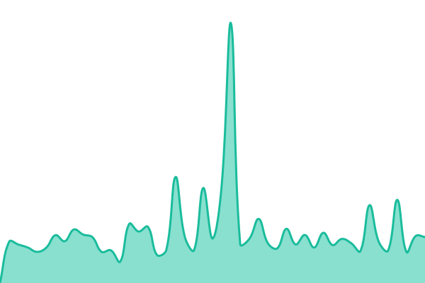

# YinwuRealm 服务状态

监测 [YinwuRealm 官网](https://www.yinwurealm.org/) 的可用性、响应时间和故障恢复情况。

- [查看状态页](https://yinwupotato.github.io/yinwurealm-status/)
- [查看检测任务](https://github.com/YinwuPotato/yinwurealm-status/actions/workflows/uptime.yml)
- [查看故障记录](https://github.com/YinwuPotato/yinwurealm-status/issues)

## 当前状态：<!--live status--> **所有服务运行正常**

<!--start: status pages-->
<!-- This summary is generated by Upptime (https://github.com/upptime/upptime) -->
<!-- Do not edit this manually, your changes will be overwritten -->
<!-- prettier-ignore -->
| 地址 | 状态 | 历史记录 | 响应时间 | 可用率 |
| --- | ------ | ------- | ------------- | ------ |
|  [YinwuRealm 官网](https://www.yinwurealm.org/) | 正常 | [website.yml](https://github.com/YinwuPotato/yinwurealm-status/commits/HEAD/history/website.yml) | 

 575毫秒
     
 | 

<a href="https://YinwuPotato.github.io/yinwurealm-status/history/website">100.00%</a>
    

<!--end: status pages-->

Cloudflare 每五分钟启动一次 GitHub Actions 检测。监测结果保存在此仓库，故障与恢复记录保存在 Issues，状态页由 GitHub Pages 发布。目前不启用邮件或 Discord 通知。

最近一次检测是否完成，请查看 Actions。网站状态不变时，普通检测不会每次新增提交；`history/website.yml` 的更新时间不是每轮检测时间。

## 维护

- 监测网址、页面文字与备用时间表：[.upptimerc.yml](.upptimerc.yml)
- GitHub 配置与日常维护：[维护说明](docs/维护说明.md)
- Cloudflare 部署与令牌续期：[调度说明](cloudflare/README.md)

配置与自编调度维护：Soidraw。监测程序与状态页：[Upptime](https://github.com/upptime/upptime)。保留上方 HTML 注释标记，自动任务需要它们更新状态。
